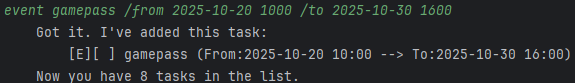

# BERT (Bot for Echo, Response and Talk) User Guide

BERT(Bot for Echo, Response and Talk) is a task tracking chatbot, 
being uses in Command Line Interface(CLI).

# Quick Start
1. Ensure you have Java 17 or above installed in your Computer.
2. Download the latest `.jar` file [here](https://github.com/gbinw128/ip/releases/tag/A-Jar).
3. Copy the `.jar` file to the folder you want to use as the home folder for 
BERT(Preferably an empty folder).
4. Open a command terminal, `cd` into the folder the `.jar` is in and run
`java -jar BERT.jar` command to run the chatbot.
5. Type in the commands and press Enter to execute it e.g. typing `bye` and 
pressing enter will exit the program.
6. Refer to the [Features](#features) below for details of each command.

# Features

###
## List tasks: `list`

Shows the list of all recorded tasks.

Format: `list`

Example:

###
## Finding task: `find`

Find all tasks whose item contains the given keyword.

Format:`find <keyword>`

Example:

###
## Marking a task as done: `mark`

Marks a task as done.

Format: `mark <item number>`

Example:

###
## Unmarking a task as done: `unmark`

Unmarks a task as done.

Format: `unmark <item number>`

Example:

###
## Adding a Todo-type task: `todo`

Adds a task that is need to be done.

Format: `todo <item>`

Example:

###
## Adding a Deadline-type task: `deadline`

Adds a task that is need to be done by a certain date/time.

Format: `deadline <item> /by <date(YYYY-MM-DD HHMM)>`

Example:

###
## Adding a Event-type task: `event`

Adds a task that has a starting and ending date/time.

Format: `event <item> /from <date(YYYY-MM-DD HHMM)> /to <date(YYYY-MM-DD HHMM)>`

Example:

###
## Exiting program `bye`

Exits the program.

Format: `bye`

#
## Saving data
Task data in BERT are saved in the hard disk manually in a text file
only when exiting the program, through the `bye` command.

# Command Summary

| Action   | Second Header                                                                                                 |
|----------|---------------------------------------------------------------------------------------------------------------|
| list     | `list`                                                                                                        |
| todo     | `todo <item>`  e.g. `todo study`                                                                          |
| deadline | `deadline <item> /by <date>`  e.g. `deadline return book /by 2025-10-20 1600`                             |
| event    | `event <item> /from <date> /to <date>`  e.g. `event game event /from 2025-10-05 1000 /to 2025-10-22 1800` |
| mark     | `mark <number>` e.g. `mark 1`                                                                             |
| unmark   | `unmark <number>` e.g. `unmark 4`                                                                         |
| find     | `find <keyword>` e.g.`find book`                                                                          |
| bye      | `bye`                                                                                                         |